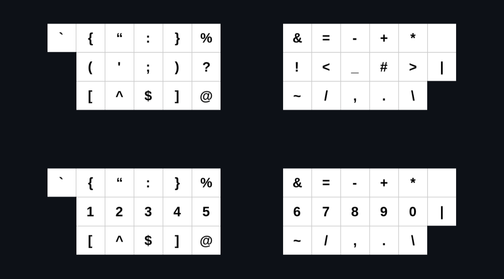

# Symbols Sense Layer
- a symbols layer that makes sense.

## Key ideas, SSLayer:

- is exceptionally easy to memorize thanks to its symmetrical intuitive design;
- is suitable for programmers, specialists, and regular users. Whether you are writing Python code, navigating in the terminal, or working in accounting software with special symbol codes - the layout is truly universal! Writing symbol-rich texts also becomes a pleasure;
- is great for non-English keyboard users, making symbol placement consistent across languages thanks to the Right Alt layer utilization. ALL symbols are accessible from ANY language - no more switching to type one symbol and no more confusion because of the different placements of the same symbols! 
- can be used with both programmable (full: symbols and numbers layers) and regular keyboards (without numbers on the home row, just SSLayer symbols and numbers in their standard places) thanks to the Right Alt layer utilization.

## Symbols placement justifications:

### General:

- `.`, `,`, `%`, `grave` are in their QWERTY places. `&`, `|` are _almost_ in their QWERTY places; 
- `{`-`}`, `(`-`)`, `[`-`]`, `<`-`>`, `!`-`|`, `?`-`!`, `/`-`\` - are placed symmetrically, making them easier to remember;
- `{}`-`[]`, `"`-`'`, `:`-`;` - are placed one above the other, just as they are accessible with Shift in QWERTY;
- `{} () []` are inward rolls
- `;) :) ;] :] ;} :}` are inward rolls as well :)
- `:`, `%`, `=`, `-`, `+`, `*`, `^`, `$`, `~`, `/`, `.` are not at the home row, therefore, they do not overlap with numbers, making it possible to type time, dates, percents, money, and use a calculator without having to switch the numbers layer! 

### Tool-specific:

- `<>` are placed where programmable keyboards users usually put their arrow keys 
- `#` at the home row, making it easier to write commets

#### Linux and Bash
 
- `~/`, `./` - CLI navigation with ease

#### Vim:

- `^`, `$` - start and end of a line 
- `:` next to `w` and `q` makes it possible for newbies to exit 
- `"`, `+` are not at the home row (therefore, they do not overlap with numbers), making Vim registers nicer
- `+` is at `y` in Colemak, making it nicer to copy from Vim to the OS clipboard

## TODO:

- Add installation instructions and files (both Linux and Windows);
- Add more tool-specific justifications (especially for various programming languages).
